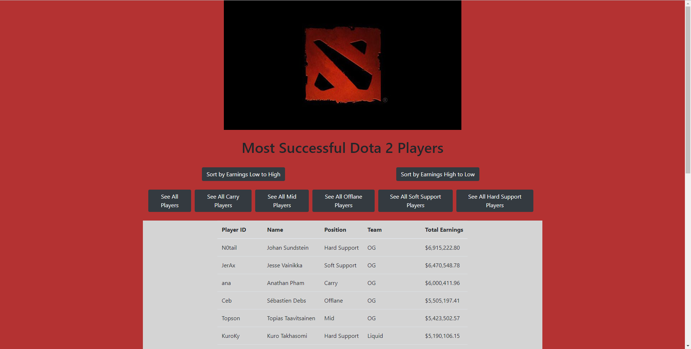
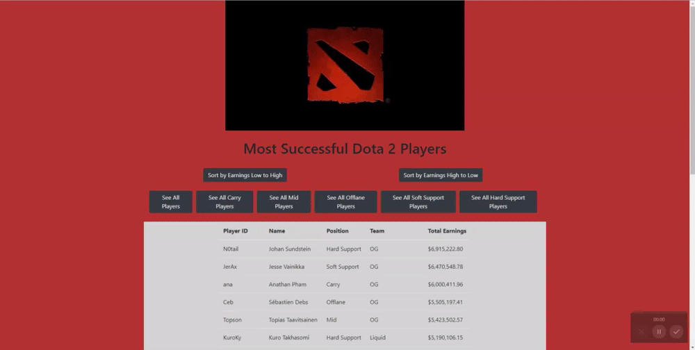
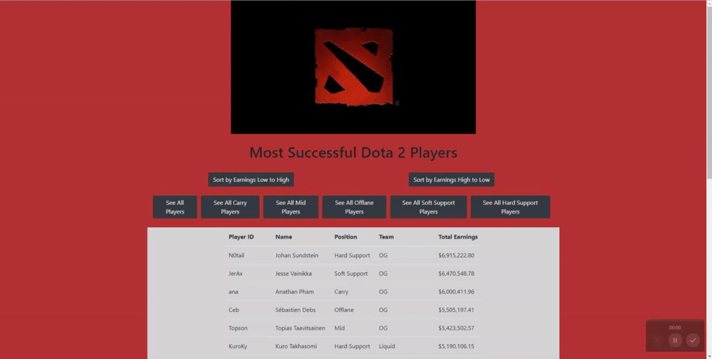

# React Player Roster

## Deployed Link

To use the app, navigate to the deployed link on Github Pages found [here](https://sbarrow825.github.io/React-Employee-Directory/)

## Description



A React based application that allows you to see the most successful professional Dota 2 players. Also allows you to sort the table of players by earnings and role.

## Table of Contents

* [Installation](#Installation)
* [Usage](#Usage)
* [License](#License)
* [Dependencies](#Dependencies)
* [Questions](#Questions)

## Installation

To install this repo for personal use, use ```git clone``` followed by the link on the green "Code" button on this repository.

Upon cloning the repo, make sure to install the neccesary dependencies using

```npm install```

Then use the following command to run the React application on your localhost

```npm run start```

## Usage

To sort players by their amount of earnings, simply click the respective "Sort by Earnings Low to High" and "Sort by Earnings High to Low" buttons.



<br>

To only see players who play a specific role, click the respective button.


<br>

The two features above can be combined, allowing you to both filter the players by a given role then sort the players of that role by their total earnings.




## License


## Dependencies

List of dependency statuses for all packages used in this project

* React 
* gh-pages 


## Questions


For any questions concerning this project, please feel free to email me at sbarrow825@berkeley.edu

